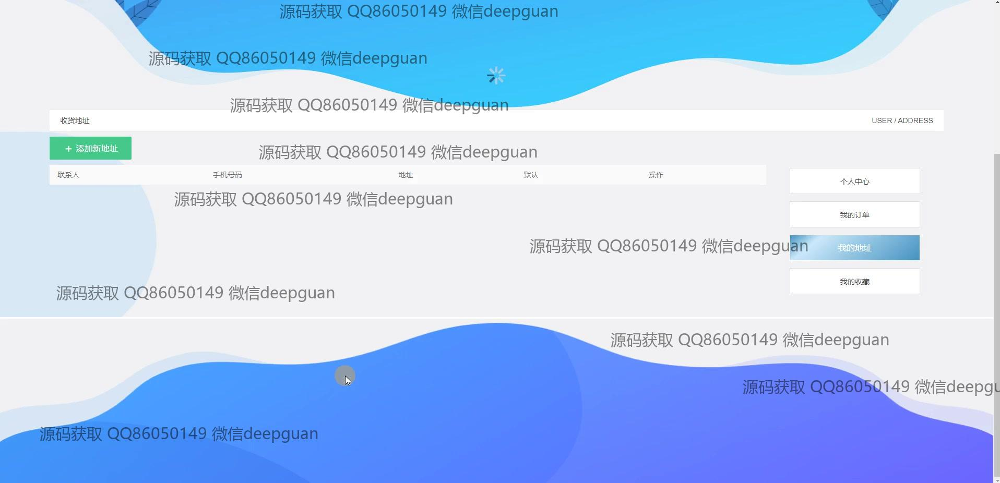
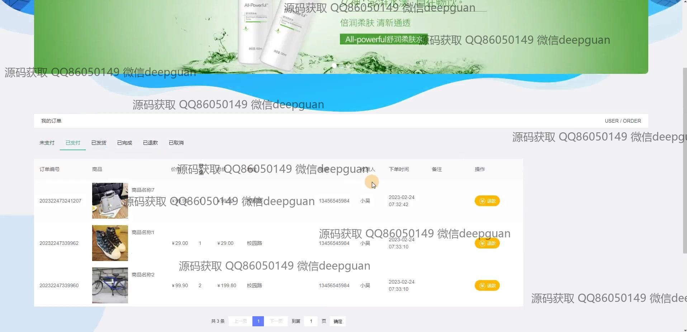

<h1 align="center">基于JavaWeb的同城闲余物品交易平台的设计与实现</h1>

## 简介
同城闲余物品交易平台：角色分为管理员、用户；实现商品发布、用户管理、订单管理、购物车功能，支持搜索、筛选、个人中心及公告管理等模块，操作便捷。    --计算机毕业设计源码；毕设源码；java毕业设计源码

## 联系方式

<h3 align="center">获取完整代码与数据库文件 + 微信：deepguan QQ: 86050149 QQ群: 783742310</h3>

<h3 align="center">可帮忙远程部署 包运行成功！提供远程部署、修改代码、设计文档指导、代码讲解等服务！</h3>

## 功能介绍（完整见运行截图）
用户：基本功能包括登录、注册、和退出。首页提供商品信息、公告信息和购物车访问入口。用户可以浏览和管理商品，查看详细信息、评论，选择购买或添加到购物车。个人中心允许修改个人信息、管理收货地址及订单查看。此外，还可以管理收藏夹、进行余额充值和支付操作。

管理员：拥有用户所具备的各种功能外，还包括系统管理权限。可以进行用户管理、商品分类和信息管理、订单管理等操作。管理员可以查看、修改商品，与用户订单交互，同时也可以添加公告、编辑公告及其他相关系统信息。个人中心提供管理访问及数据分析工具支持，便于调整运营策略。

## 运行截图

本代码来源于网络,仅供学习参考使用!

